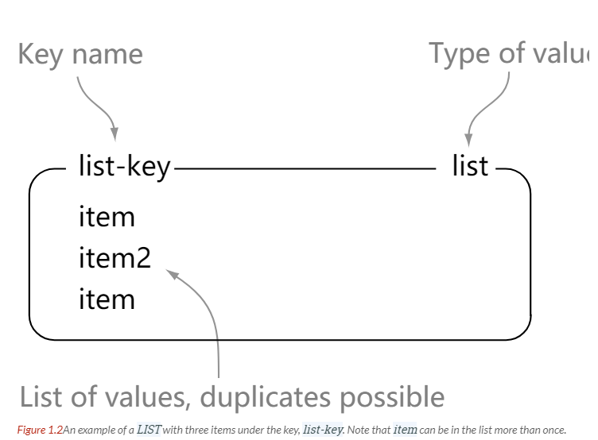

## 一、概述

Redis 是速度非常快的非关系型（NoSQL）内存键值数据库，可以存储键和五种不同类型的值之间的映射。

Redis单线程指的是网络请求模块使用了一个线程（所以不需考虑并发安全性），即一个线程处理所有网络请求，其他模块仍用了多个线程。

键的类型只能为字符串，值支持五种数据类型：字符串、列表、集合、散列表、有序集合。

Redis 支持很多特性，例如将内存中的数据持久化到硬盘中，使用复制来扩展读性能，使用分片来扩展写性能。

## 二、基本数据类型


| 结构类型         | 结构存储的值                                                 | 结构的读写能力                                               |
| :--------------- | :----------------------------------------------------------- | ------------------------------------------------------------ |
| STRING           | 字符串，整数或浮点数                                         | 对整个字符串或者字符串的一部分进行操作<br />对整数或者浮点数进行自增或者自建操作 |
| LIST             | 一个链表，链表上的每个节点都包含了一个字符串                 | 从链表的两端推入或弹出元素<br />根据偏移量对链表进行修剪(trim)<br />读取单个或多个元素<br />根据值查找或移除元素 |
| SET              | 字符串的无序收集器，被包含的每个字符串独一无二               | 添加，获取，移除单个元素<br />检查一个元素是否存在一集合中<br />计算交集，并集，差集<br />从集合里面随机获取元素 |
| HASH             | 包含键值对的无序散列表                                       | 添加，获取，移除单个键值对<br />获取所有键值对               |
| ZSET（有序集合） | 字符串成员（member）与浮点数分值（score）之间的有序<br />映射元素的排列顺序由分值的大小决定 | 添加，获取，移除单个元素<br />根据分值范围（range）或者成员来获取元素 |


### STRING


```html
127.0.0.1:6379> set hello world   # 将键 hello 的值设为 world
OK
127.0.0.1:6379> get hello         # 获取存储在键 hello 中的值
"world"
127.0.0.1:6379> del hello         # 删除键为 hello 的键值对	
(integer) 1
127.0.0.1:6379> get hello
(nil)
```


### LIST



```html
127.0.0.1:6379> rpush list-key 2       # rpush 和 lpush  分别将元素推入列表的左端和右端，返回当前列表的长度
(integer) 1
127.0.0.1:6379> lpush list-key 1
(integer) 2
127.0.0.1:6379> rpush list-key 3
(integer) 3
127.0.0.1:6379> lrange list-key 0 -1   #  lrange 获取指定范围上的所有值，0 为开始索引， -1 为列表尾部索引
1) "1"
2) "2"
3) "3"
127.0.0.1:6379> lindex list-key 0      #  lindex 获取列表指定位置的元素
"1"
127.0.0.1:6379> rpop list-key          #  lpop 和 rpop 分别从列表的左端和右端弹出元素，返回被弹出的值
"3"
127.0.0.1:6379> lpop list-key
"1"
127.0.0.1:6379> lrange list-key 0 -1
1) "2"
```


### SET


```html
127.0.0.1:6379> sadd set-key item1    # sadd 将给定元素添加到集合，返回1表示成功，返回0表示元素已存在集合中
(integer) 1
127.0.0.1:6379> sadd set-key item2
(integer) 1
127.0.0.1:6379> sadd set-key item3
(integer) 1
127.0.0.1:6379> sadd set-key item1
(integer) 0
127.0.0.1:6379> smembers set-key         #  smembers 返回集合中的所有元素
1) "item3"
2) "item2"
3) "item1"
127.0.0.1:6379> sismember set-key item4  #  sismember 检查给定元素是否存在于集合中
(integer) 0
127.0.0.1:6379> sismember set-key item1
(integer) 1
127.0.0.1:6379> srem set-key item3       #  srem 如果给定元素存在于集合中，那么移除这个元素
(integer) 1
127.0.0.1:6379> smembers set-key
1) "item2"
2) "item1"
```


### HASH


```html
127.0.0.1:6379> hset hash-key sub-key1 sub-value1  #  hset 在散列里面关联给定的键值对
(integer) 1
127.0.0.1:6379> hset hash-key sub-key2 sub-value2
(integer) 1
127.0.0.1:6379> hset hash-key sub-key1 sub-value1
(integer) 0
127.0.0.1:6379> hgetall hash-key                   #  hgetall 获取散列里包含的所有键值对
1) "sub-key1"
2) "sub-value1"
3) "sub-key2"
4) "sub-value2"
127.0.0.1:6379> hdel hash-key sub-key2             #  hdel 如果给定的键存在于散列中，那么移除这个键
(integer) 1
127.0.0.1:6379> hdel hash-key sub-key2
(integer) 0
127.0.0.1:6379> hget hash-key sub-key1             #  hget 获取指定散列键的值
"sub-value1"
127.0.0.1:6379> hgetall hash-key
1) "sub-key1"
2) "sub-value1"
```


### ZSET


```html
127.0.0.1:6379> zadd zset-key 99 member1      # zadd 将一个带有给定分值(score)的成员(member)添加到有序集合
(integer) 1
127.0.0.1:6379> zadd zset-key 999 member2
(integer) 1
127.0.0.1:6379> zadd zset-key 9999 member3
(integer) 1
127.0.0.1:6379> zadd zset-key 9999 member3
(integer) 0 
127.0.0.1:6379> zrange zset-key 0 -1         # zrange 根据元素在有序集合中所处的位置，从中获取多个元素
1) "member1"
2) "member2"
3) "member3"
127.0.0.1:6379> zrange zset-key 0 -1  withscores
1) "member1"
2) "99"
3) "member2"
4) "999"
5) "member3"
6) "9999"
127.0.0.1:6379> zrangebyscore zset-key 99 999 withscores  # 获取有序集合在给定分值范围内的所有元素
1) "member1"
2) "99"
3) "member2"
4) "999"
127.0.0.1:6379> zrem zset-key member3   # zrem 如果给定成员存在于有序集合中，那么移除这个成员
(integer) 1
127.0.0.1:6379> zrem zset-key member3
(integer) 0
127.0.0.1:6379> zrange zset-key 0 -1 withscores
1) "member1"
2) "99"
3) "member2"
4) "999"
```


## 三、数据结构


### 简单动态字符串

Redis 没有使用 C 语言传统的字符串表示（以空字符结尾的字符串数组），而是自己构建了`简单动态字符串（simple dynamic string,SDS）`的抽象类型用作 Redis 的默认字符串表示

```c
struct sdshdr {
  // 记录 buf 数组中已经使用的字节数量，空字符呢不计算在内
  // 等于 SDS 所保存的字符串的长度
  int len;
  // 记录 buf 数组中未使用的字节数量
  int free;
  // 字节数组，用来保存字符串
  char buf[];
}
```


#### SDS 与 C 字符串的区别

- SDS 可以常数复杂度获取字符串的长度，因为 SDS 中 len 属性记录了字符串长度，而 C 字符串不行
- SDS 杜绝缓冲区溢出，得益于它的空间分配策略，而 C 字符串不行
- 修改字符串时带来的内存重分配次数：
  - 空间预分配：当 SDS 需要进行空间扩展的时，程序会为 SDS 分配必须的空间外再分配额外未使用的空间；分配的规则是，如果增长字符串后，新的字符串比1MB小，则额外申请字符串当前所占空间的大小作为free值；如果增长后，字符串长度超过1MB，则额外申请1MB大小。
  - 惰性空间释放：当 SDS 需要缩短 SDS 保存字符串的时，程序并不立即使用内存分配回收空间，而是使用 free 属性将这些字节数量纪录下来，并等待将来使用

- SDS 二进制安全
- SDS 兼容部分 C 字符串函数


### 字典

```c
typedef struct dictht {
  // 哈希表数组
  dictEnrty **table;
  // 哈希表大小
  unsigned long size;
  // 哈希表大小掩码，用于计算索引值
  // 总是等于 size - 1
  unsigned long sizemask;
  // 该哈希表已有节点的数量
  unsigned long used;
}
```

```c
typedef struct dictEntry {
    // 键
    void *key;
    // 值
    union{
      void *val;
      uint64_tu64;
      int64_ts64;
    }
    // 指向下一个哈希表节点，形成链表
    struct dictEntry *next;
} dictEntry;
```


### 跳跃表

```c
typedef struct zskiplist {
    // 表头节点和表尾节点
    struct zskiplistNode *header, *tail;
    // 表中节点数量
    unsigned long length;
    // 表中层数最大的节点的层数
    int level;
} zskiplist;
```

```c
typedef struct zskiplistNode{
  // 层
  struct zskiplistLevel{
    // 前进指针
    struct zskiplistNode *forward;
    // 跨度
    unsigned int span;
  }level[];
  // 后退指针
  struct zskiplistNode *backward;
  // 分值
  double score;
  // 成员对象
  robj *obj;
}zskiplistNode;
```


## 四、


## 五、


## 六、


## 七、


## 八、

